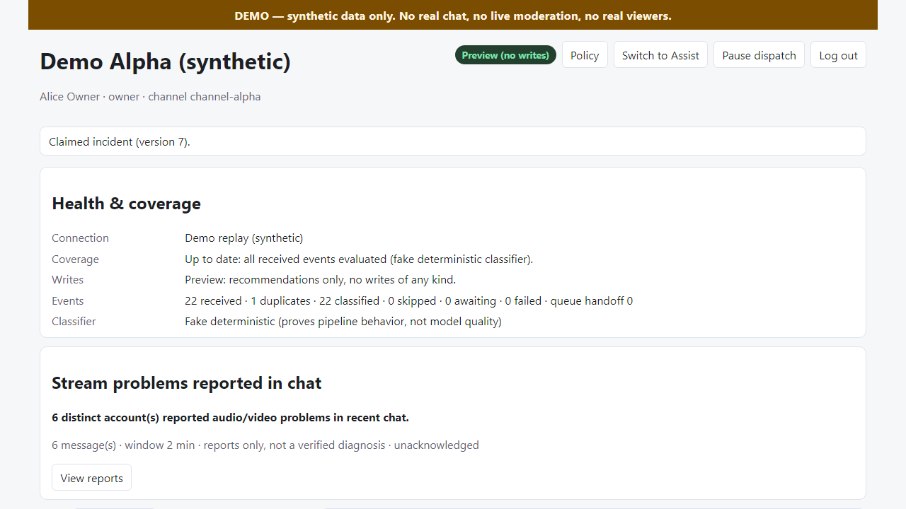
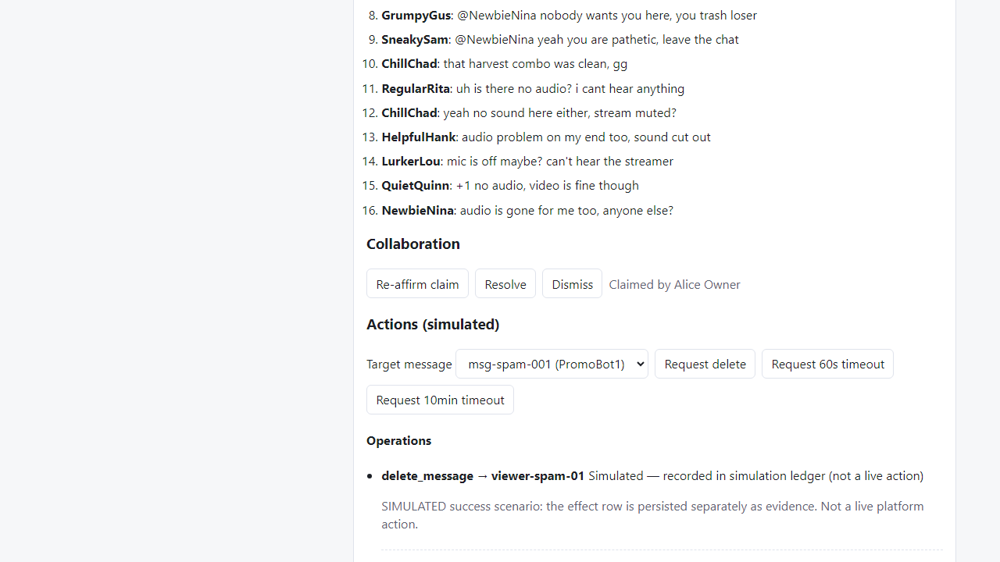

# M0 demo guide — local replay product

This guide runs the M0 vertical slice on a clean checkout: PostgreSQL + API + worker + web, seeded demo workspaces, deterministic synthetic replay, and a human-approved simulated action. No API keys, platform credentials, or network access beyond localhost and npm are required.

All chat in fixtures is **fictional and labeled synthetic**. Nothing here contacts Twitch, Jev, or any external service.

## 1. Prerequisites

- Node.js 24 LTS and npm 11 (`node --version` should print `v24.x`).
- PostgreSQL 16 reachable at `localhost:5432` with role `livestream` / password `livestream`.
  - With Docker: `docker compose up -d db`.
  - Without Docker (Windows example): use portable binaries, `initdb -U livestream`, and start with `pg_ctl -D <data> -o "-p 5432" start`. If `initdb` crashes under a non-C locale, retry with `--no-locale`.

## 2. Setup (clean checkout)

```powershell
cp .env.example .env
npm ci
node scripts/db-ensure.mjs   # create the DATABASE_URL database if missing
npm run db:migrate           # apply packages/db/migrations in order
npm run db:seed              # demo-alpha + demo-beta, five test identities, policy v1
```

Seeded identities (development demo login only; production refuses it):

| Username | Workspace | Role |
| --- | --- | --- |
| `alice` | demo-alpha | owner |
| `bob`, `cara` | demo-alpha | moderator |
| `dave` | demo-beta | owner |
| `erin` | demo-beta | moderator |

## 3. Run the stack

Three processes (separate terminals):

```powershell
npm run dev:api       # http://localhost:3001
npm run dev:worker    # outbox -> pg-boss -> pipeline + simulated dispatch
npm run dev:web       # http://localhost:5173 (proxies /api to :3001)
```

Health: `GET http://localhost:3001/api/health` reports `demo: true`, `db: ok`, and the outbox depth.

## 4. Replay synthetic chat

```powershell
npm run replay:basic           # 22 unique events + 1 duplicate delivery -> demo-alpha
npm run replay:adversarial     # injection, HTML payload, scam, fictional PII, ambiguous probe
```

Replay posts through the real durable intake endpoint (`POST /api/workspaces/:id/replay`): same validation, same transaction, same outbox as later adapters. Duplicate deliveries return success without new work.

Fixture coverage (`fixtures/`):

- Coordinated spam variants (6 accounts, one grouped incident).
- Channel-appropriate banter and ordinary conversation (stays out of the inbox).
- Repeated targeted hostility (3 messages, 2 accounts, one target).
- Chat-reported audio problem (6 distinct accounts in 2 minutes).
- Adversarial: prompt injection (flagged, never obeyed), HTML/script payload, malicious URL, fictional private-information disclosure (masked), ambiguous-outcome probe, unsupported-language abstention.

## 5. Demo procedure (about 5 minutes)

1. Open http://localhost:5173. Note the unmistakable **DEMO** banner. Log in as **Alice** (owner, Alpha).
2. Observe Preview: the mode badge reads **Preview (no writes)**; Health explains coverage and that writes are disabled.
3. Run `npm run replay:basic` (if not already). Within seconds the inbox shows **Possible coordinated spam** (6 accounts, 6 messages) and **Possible targeted hostility**; the stream card reports **6 distinct accounts** with audio problems.
4. Open the spam incident: original evidence, bounded context, channel rule, observed pattern, uncertainty, eligible actions.
5. **Claim** it, then open a second browser (or private window) as **Bob**: the card shows Alice's claim; Bob's own claim attempt is refused with *Handled by another moderator*.
6. Click **Switch to Assist**, confirm the explicit transition. Note the badge change and that everything still says *simulated*.
7. Select a target message, **Request delete**, then **Approve & queue**. The operation moves to *Simulated — recorded in simulation ledger*. Approvals expire after 120 seconds and revalidate versions.
8. **Refresh**: the same single logical action is recovered — no duplicate. The audit trail records request/approve/success.
9. Open **Policy**: preview a Strict draft (zero writes — counts unchanged), then save it as v2 and watch pending approvals supersede honestly.
10. Replay the adversarial fixture; open the masked private-information incident and **reveal deliberately** (audited). Note injection text created no incident and changed no policy.

Screenshots from a passing run:




## 6. What the tests prove

- `npm run test` — unit: normalization, grouping keys, severity, policy routing, dispatch checklist, fake-classifier determinism, adapter contracts.
- `npm run test:integration` — real PostgreSQL: duplicate/out-of-order delivery, order-independent grouping, idempotent reprocessing, claim races, cross-tenant denial, approve/dispatch lifecycle, idempotent replay, missing-target rejection, ban refusal, stale/expired/superseded approvals, atomic authority fencing (pause/mode/policy vs dispatch race both directions, separate connections, explicit barriers), crash-window recovery from durable evidence without re-execution, unknown/reconcile/refused outcomes (evidence-bound success, post-cutoff refused, foreign-row isolation), truthful coverage/backlog from persisted processing state, Preview zero-write (asserted on executor calls and row counts), evidence masking + audit, revoked-moderator cutoff, cursor resume/reset, honest health counts.
- `npm run test:e2e` — real browser + worker + PostgreSQL: the full journey above, cross-workspace isolation, injection inertness, HTML escaping (no script execution), masked reveal, and two-session claim convergence.

## 7. Teardown

- Stop the three processes (Ctrl+C). The worker drains pg-boss gracefully; durable work survives restart.
- `docker compose down` stops PostgreSQL; add `-v` to drop demo data.
- `npm run db:reset` drops and re-applies the schema on a local database (refuses production).

## 8. Known M0 limitations

- Fake classifier only; no Jev calls, no quality claims.
- Durable simulated-evidence ledger only (the executor is a pure scenario oracle; only persisted, exactly-bound effect rows count as application); no Twitch reads/writes, no OAuth, no webhooks.
- Demo token auth; production needs sessions, cookies, CSRF, TLS, and secrets management (blocked).
- No retention/TTL jobs, backups, or disconnect/deletion flows yet (M2 scope).
- SSE uses a demo `?token=` fallback because `EventSource` cannot set headers; production will use HttpOnly cookies.
- Single-channel-per-workspace demo; no Kick/YouTube adapters (correctly absent, not faked).
